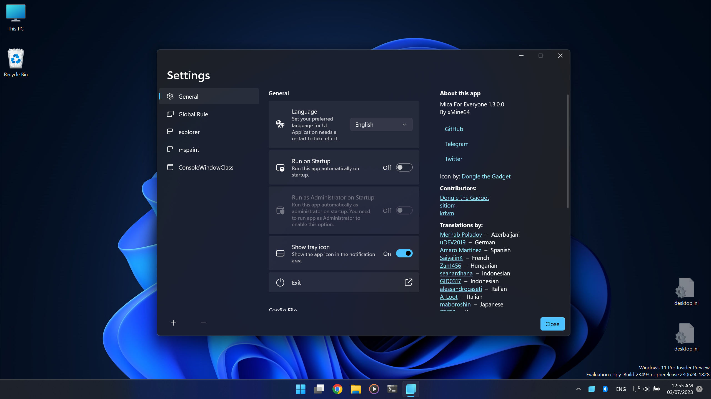
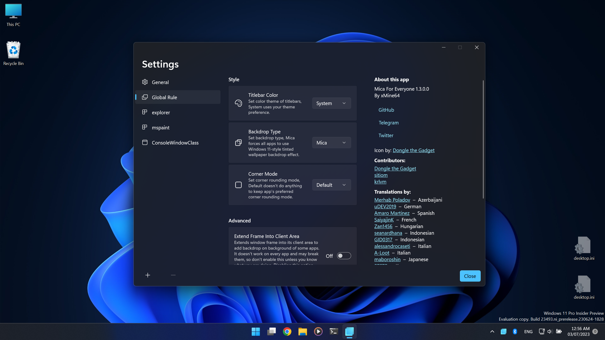
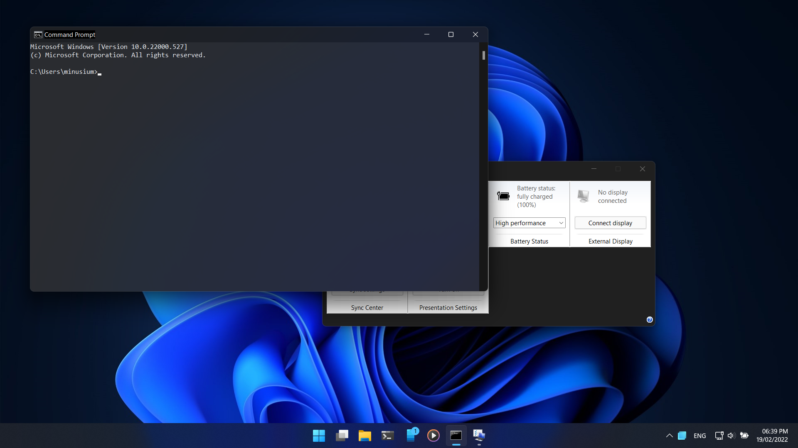

# MicaForEveryone-Downloads-and-source-code

  

<h1 align="center">Mica For Everyone!</h1>

  
  

**Mica For Everyone** is a tool to customize system backdrop on Win32 apps using [DwmSetWindowAttribute](https://docs.microsoft.com/en-us/windows/win32/api/dwmapi/nf-dwmapi-dwmsetwindowattribute) and other methods.
It can apply Mica (or any other backdrop materials) on the non-client area (window frame) or background of supported apps and its behavior is customizable through a GUI and a config file.

> **NOTE**: Mica For Everyone is not responsible for rendering the effects you set, it just asks Windows to do that for you. If there's any problem with the effects it's a third-party issue. Try creating a rule for the affected apps and try different settings before opening an issue for it.

## 🕹 How do I get it?
in this way
## 🛠 Config File
For more information check our [wiki page](https://github.com/MicaForEveryone/MicaForEveryone/wiki/Config-File) and [default config file](MicaForEveryone/Resources/MicaForEveryone.conf).

## 🖥 Screenshots

 
## 🖊️ Contributing
If you're interested in contributing or translating Mica For Everyone, check our [CONTRIBUTING.md](CONTRIBUTING.md) file.

## ☑️ Frequency Asked Questions
Check [wiki page](https://github.com/MicaForEveryone/MicaForEveryone/wiki/FAQ) or [issues](https://github.com/MicaForEveryone/MicaForEveryone/issues).
